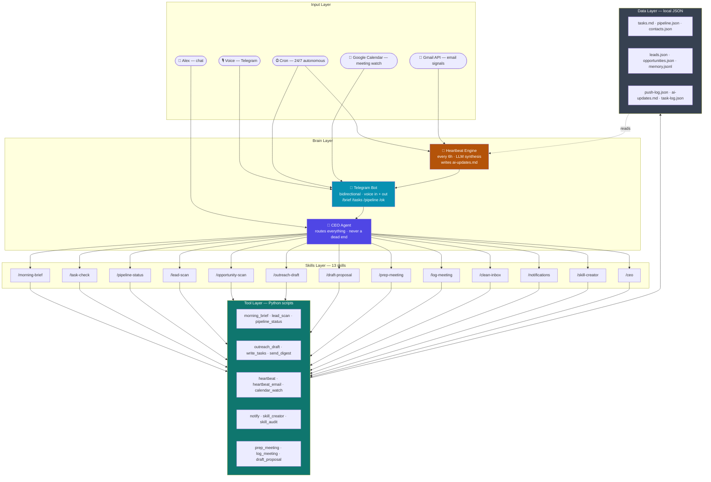
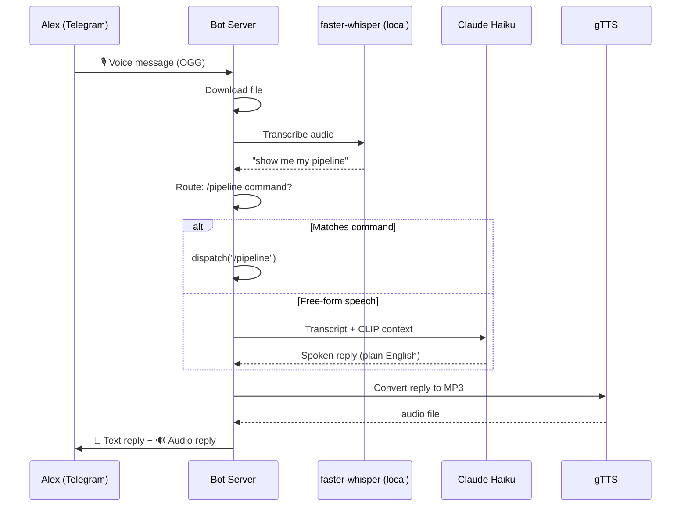

# CLIP OS
**Claude-based Intelligent Personal OS** — Alex's autonomous executive assistant.

Manages business operations, client pipeline, lead generation, outreach, and daily productivity — powered by Claude. Not a chatbot. A system that runs the back-office of a one-person B2B agency, 24/7, proactively.

---

## Architecture — The Jarvis Stack



---

## Voice Flow



---

## Autonomous Monitoring — What Runs Without You

```
┌─────────────────────────────────────────────────────────────────┐
│  CLIP OS — Live Cron Schedule                                   │
├──────────────────┬──────────────────────────────────────────────┤
│  @reboot         │  Telegram bot (auto-restart loop)            │
│  Every 30min     │  Email watch → Telegram if unanswered >24h   │
│  Every 30min     │  Calendar watch → prep brief at 30min window │
│  Every 30min     │  Data sync → git push data/                  │
│  Every 6h        │  Heartbeat → ai-updates.md + Telegram push   │
│  Daily 9:00 IST  │  Morning brief → email digest                │
│  Mon 9:00 IST    │  Weekly full brief → email digest            │
│  Mon 9:30 IST    │  Skill audit → Telegram if health issues     │
└──────────────────┴──────────────────────────────────────────────┘
```

---

## Skills Directory

| Skill | Trigger | What it does | Tool |
|-------|---------|--------------|------|
| `/morning-brief` | "brief me", "what's on today" | Daily briefing — tasks, pipeline, schedule | `morning_brief.py` |
| `/task-check` | "what's on my plate", "add task X" | Manage to-dos — Urgent / This Week / Backlog | `write_tasks.py` |
| `/pipeline-status` | "show pipeline", "move X to qualified" | Full CRM — view, add, move, flag stale | `pipeline_status.py` |
| `/lead-scan` | "find leads", "who should I pitch" | Scan web for automation pitch targets | `lead_scan.py` |
| `/opportunity-scan` | "what should I build", "West→India" | West→India product opportunity research | `opportunity_scan.py` |
| `/outreach-draft` | "draft email for X", "write pitch to Y" | Personalized cold emails via Claude + Apollo | `outreach_draft.py` |
| `/draft-proposal` | "draft proposal for X" | Structured automation proposals → `proposals/` | `draft_proposal.py` |
| `/prep-meeting` | "prep me for call with X" | Pre-call brief from contact history + pipeline | `prep_meeting.py` |
| `/log-meeting` | "log my call with X" | Record notes + action items → `contacts.json` | `log_meeting.py` |
| `/clean-inbox` | "check my inbox", "triage email" | Gmail triage — search, label, archive, reply | Gmail MCP |
| `/notifications` | "test telegram", "show push log" | Manage Telegram push channel + push history | `notify.py` |
| `/skill-creator` | "build a skill for X", "update skill Y" | WAT scaffold generator + eval runner | `skill_creator.py` |
| `/ceo` | anything unmatched | Router + catch-all + proposes new skills | `ceo_router.py` |

---

## The WAT Framework

Every action in CLIP follows one chain — no exceptions:

```
Skill (SKILL.md)  →  Workflow (workflows/*.md)  →  Tool (tools/*.py)  →  Data (data/*.json)
     Intent              Step-by-step SOP            Python executes        State persists
```

**Rules:**
- Claude reasons, Python executes, JSON stores
- No skill ever touches data directly — always through a tool
- Every action is logged: `python3 tools/log_entry.py`
- Secrets live only in `.env` — never in code or commits

---

## Phase History

```
phase-1-complete  ── CLIP OS v1.0: 11 skills, 18 tools, full WAT system
phase-2-complete  ── lead scan v2, subscription tracker, opportunity scan
phase-3-complete  ── heartbeat engine, Gmail SMTP, Google Calendar, email briefs
phase-4-complete  ── Jarvis mode: Telegram push + voice + bidirectional bot + skill health
```

Current: **Phase 4 complete** — CLIP is ambient, proactive, and bidirectional.
Next: **Phase 5** — Obsidian vault sync + NotebookLM deep research *(Q3 2026)*

See [`ROADMAP.md`](ROADMAP.md) for full phase details and what's next.

---

## File Map

```
clip-os/
│
├── context/                   Business context — loaded every session
│   ├── me.md                  Who Alex is, communication style
│   ├── work.md                Business, active clients, ICP
│   ├── team.md                Team members + roles
│   └── priorities.md          Current month goals
│
├── .claude/skills/            13 skill instruction files (one SKILL.md each)
│
├── workflows/                 Step-by-step SOPs (one per skill)
│
├── tools/                     Python execution layer — always python3
│   ├── notify.py              Telegram push primitive (dedup, urgency)
│   ├── heartbeat.py           6h intelligence engine + LLM synthesis
│   ├── heartbeat_email.py     30min unanswered email watcher
│   ├── calendar_watch.py      30min meeting prep trigger
│   ├── skill_creator.py       WAT scaffold generator
│   ├── skill_audit.py         Weekly skill health check
│   ├── morning_brief.py       Daily brief generator
│   ├── lead_scan.py           Tavily web search → leads.json
│   ├── opportunity_scan.py    West→India market scanner
│   ├── outreach_draft.py      Cold email writer (Claude API + Apollo)
│   ├── pipeline_status.py     CRM read/write + stage management
│   ├── send_digest.py         Gmail SMTP sender
│   ├── log_entry.py           Reflexion logger → task-log.json
│   ├── write_memory.py        Cross-session memory writer
│   ├── prep_meeting.py        Pre-call brief generator
│   ├── log_meeting.py         Meeting notes writer
│   └── draft_proposal.py      Client proposal generator
│
├── bot/
│   └── telegram_bot_server.py  Bidirectional Telegram bot + voice pipeline
│
├── data/                      Persistent state — gitignored, stays local
│   ├── tasks.md               Active task list
│   ├── pipeline.json          CRM contacts + deal stages
│   ├── contacts.json          Meeting history + contact details
│   ├── leads.json             Lead database
│   ├── opportunities.json     West→India opportunity tracker
│   ├── push-log.json          Telegram push dedup log
│   ├── ai-updates.md          Heartbeat synthesis output
│   ├── memory.jsonl           Durable cross-session memory
│   └── task-log.json          Full skill interaction audit log
│
├── proposals/                 Generated client proposals (gitignored)
├── CLAUDE.md                  Master instructions — loaded every session
├── ROADMAP.md                 Forward-looking phases + what's blocked
├── SETUP.md                   API key + integration setup guide
└── ONBOARDING.md              New machine setup (~15 min)
```

---

## Tech Stack

| Layer | Tech | Status |
|-------|------|--------|
| Reasoning | Claude Sonnet 4.6 (session) + Haiku 4.5 (voice/bot) | ✅ Live |
| Push channel | Telegram Bot API (requests, long-polling) | ✅ Live |
| Voice STT | faster-whisper (local, Apple Silicon) | ✅ Live |
| Voice TTS | gTTS (Google TTS, free) | ✅ Live |
| Web search | Tavily API | ✅ Live |
| Email read | Gmail API (direct OAuth) | ✅ Live |
| Email send | Gmail SMTP (acmestudio.com, DKIM) | ✅ Live |
| Calendar | Google Calendar API | ✅ Live |
| Inbox/session | Google Workspace MCP | ✅ Live |
| Storage | Local JSON + markdown (gitignored) | ✅ Live |
| Scheduling | macOS cron (8 jobs) | ✅ Live |
| Contact enrich | Apollo.io | 🔑 Needs key |
| Background LLM | DeepSeek V3 (10x cheaper) | 📅 Planned |
| Cloud fallback | Railway (for when Mac is off) | 📅 Planned |

---

## Setup

```bash
cp .env.example .env              # add API keys — see SETUP.md
pip3 install -r requirements.txt  # includes faster-whisper, gTTS
python3 tools/morning_brief.py    # verify it runs
claude                            # open CLIP, say "hi"
```

Full integration setup → [`SETUP.md`](SETUP.md)
New machine / team member → [`ONBOARDING.md`](ONBOARDING.md)
